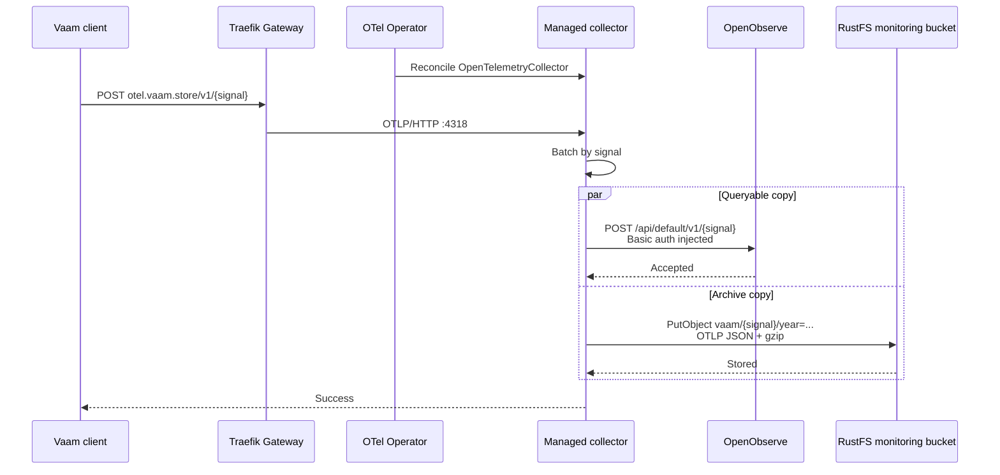
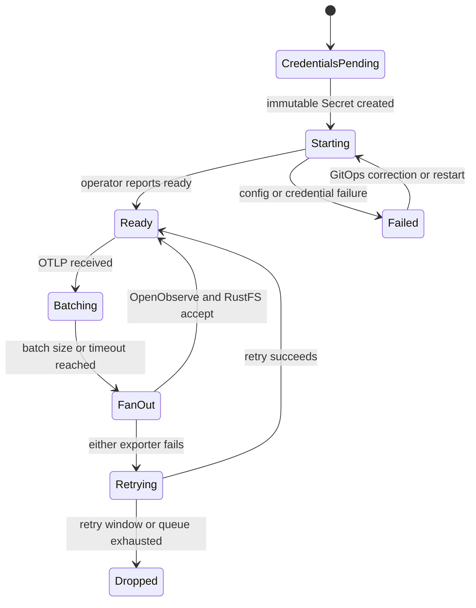

# OpenObserve

This chart replaces the ephemeral `grafana/otel-lgtm` all-in-one deployment with
OpenObserve OSS. It deliberately uses the official standalone chart because the
home workload is small and does not justify the PostgreSQL, NATS, object storage,
and role replicas required by the distributed chart.

OpenObserve `v0.92.2` and chart `0.92.2` are the latest stable versions. The newer
`v1.0.0-rc3` tag is explicitly a release candidate. The application image and
the OTLP gateway image are pinned to multi-architecture digests.

## Storage and credentials

The old LGTM deployment was ephemeral. Its telemetry, Grafana dashboards,
credentials, and configuration are intentionally discarded rather than
migrated. OpenObserve stores SQLite metadata, WAL, and Parquet data on a 50 GiB
Longhorn claim. `sstorage` is intentionally not used: it is the cluster's
NAS/NFS default, while OpenObserve's local database and WAL need block-storage
semantics.

External Secrets generates the root password exactly once and leaves the
immutable Secret behind if the chart is removed. Retrieve it without placing it
in Git:

```sh
kubectl --context admin@homeos -n openobserve get secret openobserve-root \
  -o jsonpath='{.data.ZO_ROOT_USER_PASSWORD}' | base64 -d
```

The login email is `admin@home.ssegning`; the UI is
`https://openobserve.home.ssegning`.

## Ingestion interaction

Released Vaam clients send unauthenticated OTLP/HTTP to the standard `/v1/*`
paths. The cluster's OpenTelemetry Operator owns the collector that receives
those requests. It batches every signal and fans each batch out internally to
OpenObserve and to RustFS. OpenObserve requires Basic authentication and an
organization-prefixed path, so the collector is also the protocol adapter and
credential boundary.



## Lifecycle



The RustFS archive uses the existing `monitoring` bucket and writes gzip-compressed
OTLP JSON below `vaam/logs`, `vaam/metrics`, and `vaam/traces`, partitioned by UTC
hour. External Secrets mirrors only the existing monitoring credential from the
`s3` namespace into the collector namespace; no credential is copied into Git.

The S3 exporter is alpha and fan-out is not transactional: one destination can
accept a batch while the other retries. Its queues are memory-backed, so queued
data does not survive a collector restart. The public compatibility endpoint
accepts telemetry without client authentication, as the retired LGTM receiver
did. Add an application token or edge rate limit when clients can carry a
non-secret abuse-control token.
