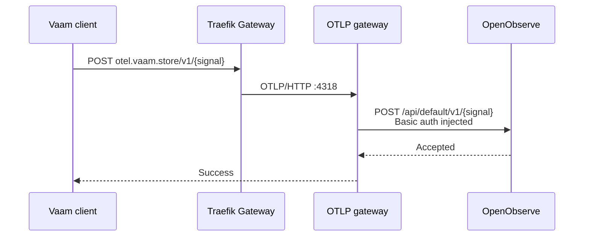
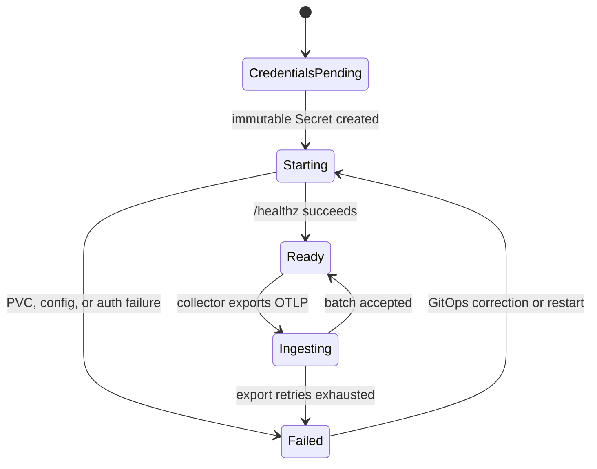

# OpenObserve

This chart replaces the ephemeral `grafana/otel-lgtm` all-in-one deployment with
OpenObserve OSS. It deliberately uses the official standalone chart because the
home workload is small and does not justify the PostgreSQL, NATS, object storage,
and role replicas required by the distributed chart.

OpenObserve `v0.92.2` and chart `0.92.2` are the latest stable versions. The newer
`v1.0.0-rc3` tag is explicitly a release candidate. The application image and
the OTLP gateway image are pinned to multi-architecture digests.

## Storage and credentials

The old LGTM deployment was ephemeral. Its telemetry, Grafana dashboards,
credentials, and configuration are intentionally discarded rather than
migrated. OpenObserve stores SQLite metadata, WAL, and Parquet data on a 50 GiB
Longhorn claim. `sstorage` is intentionally not used: it is the cluster's
NAS/NFS default, while OpenObserve's local database and WAL need block-storage
semantics.

External Secrets generates the root password exactly once and leaves the
immutable Secret behind if the chart is removed. Retrieve it without placing it
in Git:

```sh
kubectl --context admin@homeos -n openobserve get secret openobserve-root \
  -o jsonpath='{.data.ZO_ROOT_USER_PASSWORD}' | base64 -d
```

The login email is `admin@home.ssegning`; the UI is
`https://openobserve.home.ssegning`.

## Ingestion interaction

Released Vaam clients send unauthenticated OTLP/HTTP to the standard `/v1/*`
paths. OpenObserve requires Basic authentication and an organization-prefixed
path, so the collector is a protocol adapter and credential boundary.



## Lifecycle



The public compatibility endpoint accepts telemetry without client
authentication, as the retired LGTM receiver did. It exposes ingestion only;
the OpenObserve credential remains inside the namespace. Add an application
token or edge rate limit when clients can carry a non-secret abuse-control token.
