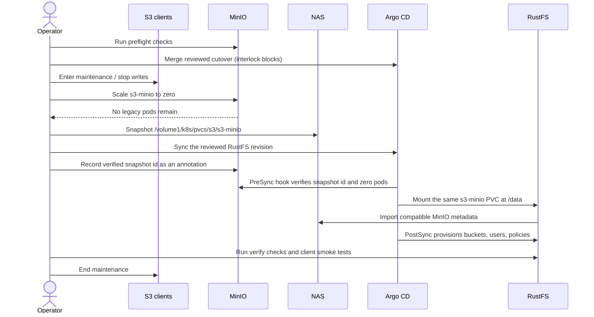
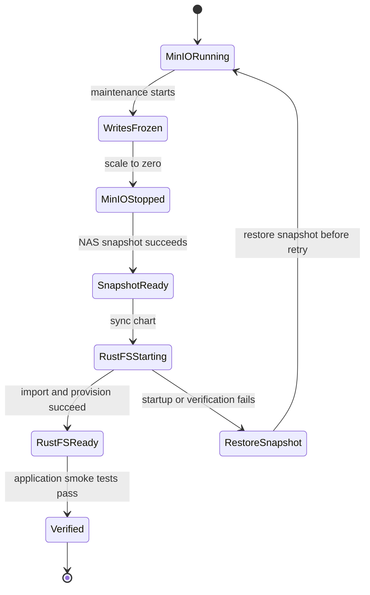

# MinIO to RustFS migration

This chart performs a one-way, in-place replacement of MinIO with RustFS. It
reuses the existing `s3-minio` PVC; it does not copy the object payloads to a
new volume.

The home cluster's `sstorage` StorageClass is NFS backed by the NAS. The bound
PVC maps to `/volume1/k8s/pvcs/s3/s3-minio` on the NAS, is retained on deletion,
and is mounted at the filesystem root by both products:

- MinIO: `s3-minio` mounted at `/bitnami/minio/data`, no `subPath`
- RustFS: `s3-minio` mounted at `/data`, no `subPath`
- Ingress objects: the historical `s3-minio` and `s3-minio-console` names are
  updated in place to route to `rustfs-svc`, avoiding duplicate host routes
- Filesystem owner: UID/GID `1001`, retained for RustFS to avoid a recursive
  ownership change that root-squashed NFS may reject

Do not sync this chart merely to test the manifest. The Argo CD application has
automated sync, pruning, and self-heal enabled. Merging the cutover revision
therefore runs its `PreSync` interlock immediately; that hook fails closed while
MinIO is running or the NAS snapshot annotation is absent.

## Compatibility boundary

RustFS can import supported MinIO `xl.meta` object metadata and the compatible
IAM/bucket configuration from the same volume. The conversion is one-way:
RustFS creates `.rustfs.sys`, and MinIO is not a valid rollback target after
RustFS has written to the volume.

Do not cut over until these are true:

- no object relies on MinIO SSE/KMS or KES encryption;
- no object is transitioned to an external tier;
- site replication is not required during the cutover;
- MinIO event notifications, online configuration, LDAP, and OIDC settings have
  either been replaced explicitly or are known to be unused;
- a restorable NAS snapshot exists from after all S3 writers and MinIO stopped.

RustFS's chart supports this one-PVC standalone topology for storage whose
durability is supplied underneath it, and this chart enables RustFS's
`high_latency` drive-timeout profile for the NFS-backed `sstorage` claim.
That is not proof that the NAS mount provides every filesystem semantic RustFS
expects. RustFS has had NFS-specific health and scanner reports, so validate
the exact rc.5 image against a writable clone of the NAS snapshot before the
production cutover; readiness alone is insufficient.

The preflight script proves the deployment, PVC, mount, UID, and metadata-marker
assumptions. It cannot prove the encryption or tiering assertions.

## Cutover interaction





## Runbook

1. Review the desired manifests without syncing them:

   ```sh
   helm dependency build charts/s3
   helm lint charts/s3
   helm template s3 charts/s3 --namespace s3 --skip-tests >/tmp/s3-rustfs.yaml
   ```

2. Run the read-only preflight from this repository:

   ```sh
   charts/s3/scripts/minio-rustfs-migration.sh preflight
   ```

3. Merge the reviewed cutover revision. Its first automatic sync is expected to
   fail at `s3-minio-cutover`, before any Sync-phase resource changes, because
   MinIO is still running and no snapshot is approved. Confirm MinIO remains
   healthy. Any other failure requires investigation before proceeding.

4. Freeze all clients that can write to these buckets. This includes logging,
   backup, workflow artifact, cache, Vaam, Vymalo, and personal-site workloads.
   Keep a list so every writer can be restored afterward.

5. Stop MinIO and wait for its pod to disappear:

   ```sh
   kubectl --context admin@homeos --namespace s3 \
     scale deployment s3-minio --replicas=0
   kubectl --context admin@homeos --namespace s3 \
     wait --for=delete pod \
     --selector app.kubernetes.io/instance=s3,app.kubernetes.io/name=minio \
     --timeout=300s
   ```

6. Take and verify a NAS snapshot of the storage behind
   `/volume1/k8s/pvcs/s3/s3-minio`. Record its identifier. Do not rely only on
   Kubernetes's `Retain` reclaim policy: that preserves the volume object but
   is not a point-in-time rollback.

   Before the production sync, attach a writable clone of this snapshot to an
   isolated RustFS rc.5 instance and exercise representative versioned objects,
   locks, multipart uploads, IAM policies, and scanner/health behavior. Never
   attach MinIO and this rehearsal instance to the same writable clone.

7. Record the verified snapshot identifier on the stopped legacy Deployment:

   ```sh
   SNAPSHOT_ID='<the exact NAS snapshot identifier>'
   kubectl --context admin@homeos --namespace s3 annotate deployment s3-minio \
     home-os.ssegning.me/rustfs-nas-snapshot="$SNAPSHOT_ID" --overwrite
   ```

8. Retry or manually sync the reviewed RustFS revision. The `PreSync` hook is a
   read-only safety interlock: it refuses the sync unless that snapshot annotation is non-empty,
   the legacy Deployment requests zero replicas, and no matching pod remains.
   It never stops MinIO or claims that a snapshot exists on the operator's
   behalf. RustFS then starts on the same PVC, and the `PostSync` job recreates
   the declared buckets, policies, anonymous access, and users.

9. Verify the cluster-side invariants:

   ```sh
   charts/s3/scripts/minio-rustfs-migration.sh verify
   ```

10. Smoke-test every S3 client. At minimum, compare bucket listings and critical
   object/version counts; perform signed GET, PUT, LIST, and DELETE operations
   with representative non-root users; verify public reads; and exercise CNPG
   backup discovery before restoring writes.

11. End maintenance. Leave the Argo CD application's existing automated sync,
    prune, and self-heal policy in place.

## Failure and rollback

If RustFS fails after it first mounts the volume, stop it and restore the NAS
snapshot before starting MinIO or retrying RustFS. Never point MinIO at a volume
that RustFS has already modified. Preserve the failed volume separately for
diagnosis instead of attempting an in-place reverse conversion.
